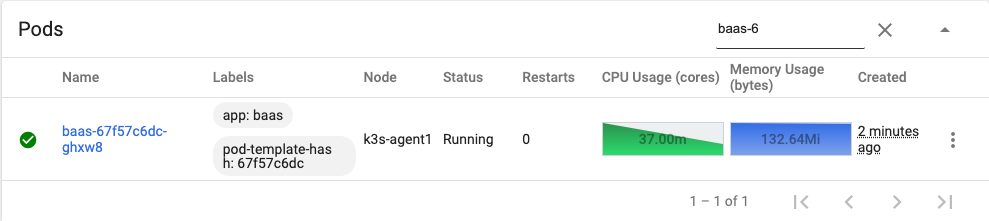
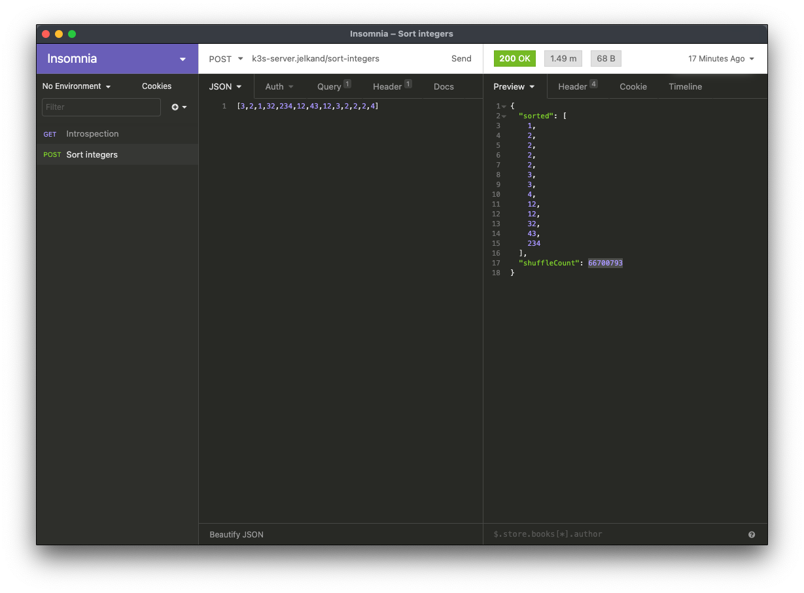
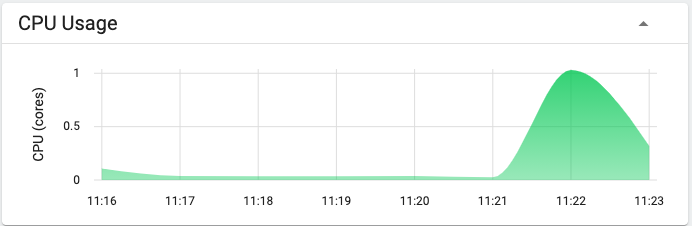
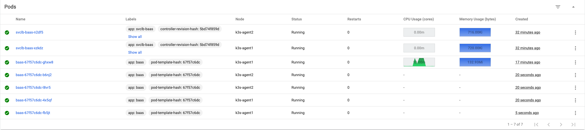

I've been working on an autoscaling demo for a minute. To do this, I've put together a homelab cluster, built a service that will hog every ounce of CPU, and deployed it.

## The baseline

BaaS (or Bogosort as a service) is designed to be incredibly inefficient. Even a relatively simple request should pin the CPU and hit any limits we've established.
The definition of the deployment is as such:

```yaml
apiVersion: apps/v1
kind: Deployment
metadata:
  name: baas
  namespace: baas
spec:
  replicas: 1
  selector:
    matchLabels:
      app: baas
  template:
    metadata:
      labels:
        app: baas
    spec:
      terminationGracePeriodSeconds: 30
      containers:
        - name: app
          image: jelkand/baas:latest
          ports:
            - containerPort: 3000
          imagePullPolicy: Always
          resources:
            requests:
              memory: '128Mi'
              cpu: '250m'
            limits:
              memory: '256Mi'
              cpu: '500m'
```

Note that when we use about 50% of a single CPU, we should be hitting a limit. It's a soft limit, so kubernetes will let us go above that for a while, but it's a limit nonetheless.

Also note that we've asked for a single replica, and when this is deployed, that's what we get. I'm excluding a couple load balancers from this list--but they're there too.



Here's the request we're sending over, via Insomnia. Note that sorting 13 integers takes a minute and a half, and nearly 67 million shuffles.



As we might expect, sending a request will take our CPU usage to the limit, up to a full CPU of utilization (the limit for a single pod on node as it's single threaded).
We have not yet added in an autoscaler, so we still only see one pod.



## Autoscaling

Let's add a horizontal pod autoscaler to the definition.

We'll scale up to a maximum of 5 replicas, and scale up when we hit 80 percent CPU utilization.

```yaml
apiVersion: autoscaling/v1
kind: HorizontalPodAutoscaler
metadata:
  name: baas
  namespace: baas
spec:
  scaleTargetRef:
    apiVersion: apps/v1
    kind: Deployment
    name: baas
  minReplicas: 1
  maxReplicas: 5
  targetCPUUtilizationPercentage: 80
```

Applying this shows us:

```bash
horizontalpodautoscaler.autoscaling/baas created
```

When we fire off another request we see four more pods spin up to handle the load--just what we'd expect. Also note that they're distributed between my two agent nodes.



In our case, we could handle a new request for each pod. There's only so much the autoscaler can do when the service is so bad.

Hopefully this has been an interesting exercise--if you'd like to chat about it, have queestions, or have feedback, please don't hesitate to say hi at blog@jackanderson.dev!
