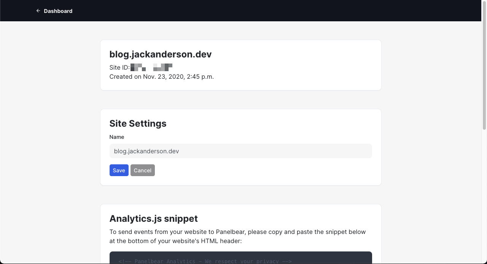
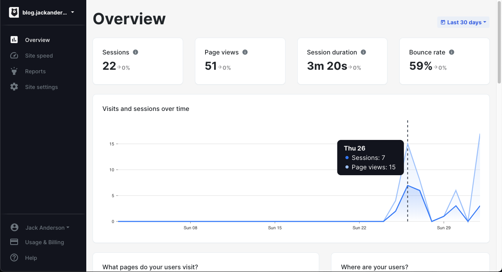

Until recently, I had a problem most people who write a blog have had. I wanted to know how often users visit my blog, and what posts they view. The solution is to add in analytics to my blog.
Ultimately, I selected Panelbear as my provider of choice, and wrote a Gatsby plugin to make integration easy on any Gatsby site. I'll share some details as to how I reached that decision and how I built
the plugin, but in the spirit of bottom-line-up-front I'll first share how to integrate it yourself.

## Adding Panelbear to Gatsby.

It goes without saying that you need an account with [Panelbear](https://panelbear.com/) first.

Ensure you collect your Site ID from your site settings page. Mine is conveniently blurred.



### Installation

Use your tool of choice. I like yarn.

`yarn add gatsby-plugin-panelbear`

The source can be found on GitHub at https://github.com/jelkand/gatsby-plugin-panelbear

### Configuration

In your `gatsby-config.js` add in the following snippet:

```javascript
{
  resolve: `gatsby-plugin-panelbear`,
  options: {
    siteID: 'YOUR_SITE_ID',
    // enable to view events while developing on localhost.
    // only for local development
    // debug: true,
  },
},
```

### Magic

Watch the events roll in. (I assume your blog gets a little more traffic than mine :) )



## Why Panelbear?

**Privacy**

I care about privacy. I _don't_ want to know too much about my readers. Collecting too much data could put me in hot water regarding various laws and regulations (GDPR, CCPA, etc.), but more than that I feel a compunction to let my readers stay private.

I run a PiHole, adblockers, privacy utilities, because I don't want my info getting reused or sold, so it only feels just to extend the same courtesy to my readers.

Panelbear collects very little compared to major trackers, and what it does collect is anonymized, which helps me feel better.

**Simplicity**

My work uses Segment, Amplitude, etc. It works great, and our various product and data teams have a gold mine of features to use. It's a pain to set up though, and it's expensive. With Panelbear, I was able to plug stuff in and see it running almost immediately.

**Cost**

Panelbear has a generous free tier. For this blog, my only expense is the domain name. Should I ever exceed the free tier, the other plans are affordable and I wouldn't have a problem paying for them.

## Building the plugin.

This turned out to be shockingly easy. When I wrote the plugin, Panelbear could only be added via adding a script tag, a complicated proposition in a static site generator. This is a common pattern in analytics libraries though, and there are plenty of example plugins to reference.

Ultimately, Gatsby's APIs were so simple that I was able to inject the Panelbear script via the `onRenderBody` hook that Gatsby provides, making the important bits of the plugin work in only 30 lines of code.

I did hit some brief snags with tracking page views, as routing is handled internally with Gatsby, but a brief email exchange with the author of Panelbear, Anthony Simon, sorted that right out. He's already updated the docs since then as well.

See the plugin on the [Gatsby Plugin Library](https://www.gatsbyjs.com/plugins/gatsby-plugin-panelbear), [NPM](https://www.npmjs.com/package/gatsby-plugin-panelbear) or on [GitHub](https://github.com/jelkand/gatsby-plugin-panelbear)
