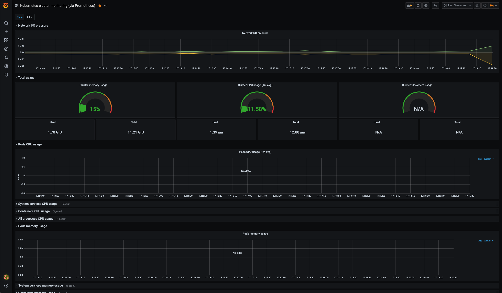

I've been working on learning more about system architecture and infrastructure lately. Last year, I did some fiddling with Kubernetes in Azure via AKS, and found even a single node cluster is pretty expensive.
This time, I figured it would be cheaper and potentially more interesting to build my own cluster as a testbed for a few projects.

My first test project is going to be fiddling with resource limits and autoscaling, so my goals for this project were chosen with that in mind.

This post is not a tutorial, just a record of what I did, and what I learned. If you're looking to build your own, skip to the end to the references. I'll share what posts and tutorials I used to do this, as well as my thoughts on what I found useful about each.

## The build

The components:

- 3 Raspberry Pi 4s, with 4GB of RAM each
- Cheap 5 port network switch
- Anker 6 port USB charger
- 4 32GB Micro SD cards
- A cluster case with 4 slots
- Cheap USB-A to USB-C cables
- Some cheap ethernet cables

All in all, this build cost me a bit under $300, which is about three months of running a node on Azure or similar. I intended to build a 4 Pi cluster, but I scaled it back to save $60. It should be easy to expand if I ever want to.

At some point, I'd love to toss PoE hats on these things, and rack mount them, but that means a PoE switch, and a server rack, and that's not a rabbit hole I'm quite ready for yet. For now, it should serve my purposes nicely.

## Setup

I ran Raspberry Pi OS Lite. Many tutorials use Ubuntu Server, presumably as there is a readily available 64-bit image, and likely has better support for vanilla Kubernetes. Pi OS has a [64-bit beta](https://www.raspberrypi.org/forums/viewtopic.php?f=117&t=275370), but it doesn't seem mature yet.

Ultimately I didn't hit too many hiccups with that. I may migrate to 64-bit once it leaves beta.

For Kubernetes, I ran [k3s](https://k3s.io). K3s is a lightweight distribution of Kubernetes by Rancher labs, and seems a perfect match for a very small test cluster running on ARM machines. Installation was quite simple.

Some speedbumps:

- The configuration for the install didn't work for me. Long flags (such as `--no-deploy traefik`) should be added into `/etc/systemd/system/k3s.service` rather than as install parameters.
  - I didn't care what load balancer or ingress controller I deployed, so I left them as default.
- I needed to manually set the `--advertise-address` flag, it kept trying to advertise on localhost, when it needed to be the IP of the host on my home network.

Once the cluster itself was running, I started down the path of getting monitoring up. Prometheus and Grafana seem to be an industry standard, but I realized that they required a persistent volume to store metrics on.

I dug up an old USB hard drive and hooked it up to the server node, provisioned it as an NFS server, and rigged up some [an NFS auto provisioner to handle my persistent volumes](https://github.com/kubernetes-retired/external-storage). Note that while that repo is deprecated, the recipes work just fine.

Once that was up and running, I had a nice looking dashboard and a ready-to-go sandbox for any projects I want to throw at it!

## Lessons

- Running and operating a linux system is still, sadly, an area where I'm not an expert.
- I'm a good bit more familiar with `kubectl`.
- _Significantly_ more familiar with Kubernetes manifests, having read a ton of them on my endless debugging quests.
- Part of me wishes I had done something like [Kubernetes The Hard Way](https://github.com/kelseyhightower/kubernetes-the-hard-way), but I have some specific goals. The beauty of this cluster is I can wipe it and restart if need be.

## The Future

Immediate work:

- Build a resource-heavy service (perhaps image processing?)
- Deploy it to the cluster
- Hammer it with [gatling](https://gatling.io)
- Watch metrics and fiddle with scaling options to understand how that's handled with Kubernetes.

General enhancements:

- I _might_ explore other dashboards like [Lens](https://k8slens.dev/) or Kubernetes Dashboard.
- I skipped a lot of stuff regarding SSL certificates, etc etc. Tutorials are readily available, but I didn't want to spend time on it given my goals.
- I may request a static IP to expose my cluster to the world.
- Get to know Ansible to provision these machines.
- More Pis???
- General homelab type stuff, such as NextCloud, Plex, etc.

## References

- [Will Ho's series of blog posts on his clustering adventures](https://ikarus.sg/kubernetes-with-k3s/)
  - This was very interesting and very approachable. I went a different direction, using default k3s resources and skipping Kubernetes Dashboard, but this got me going.
- A handful of posts by Chris Collins on homelabs:
  - [Configuring a Raspberry Pi as an NFS](https://opensource.com/article/20/5/nfs-raspberry-pi)
    - Useful and straightforward prelude to the next point.
  - [Auto-provisioning NFS on a Kubernetes cluster](https://opensource.com/article/20/6/kubernetes-nfs-client-provisioning)
    - Incredibly useful for setting up persistent volumes, a requirement for the monitoring services.
    - I spent an embarassingly long time trying to debug what I thought was an issue with this, but was really just me putting down the wrong path for my NFS.
  - Incidentally, Chris is a member of a large dev slack I participate in. I came _very_ close to messaging him for advice before realizing my silly mistake.
- This series of posts on self-hosting a Kubernetes cluster:
  - [Installing and configuring k3s](https://kauri.io/install-and-configure-a-kubernetes-cluster-with-k3s-to-self-host-applications/418b3bc1e0544fbc955a4bbba6fff8a9/a)
  - [Deploying cluster-monitoring](https://kauri.io/88-deploy-prometheus-and-grafana-to-monitor-a-kube/186a71b189864b9ebc4ef7c8a9f0a6b5/a)
